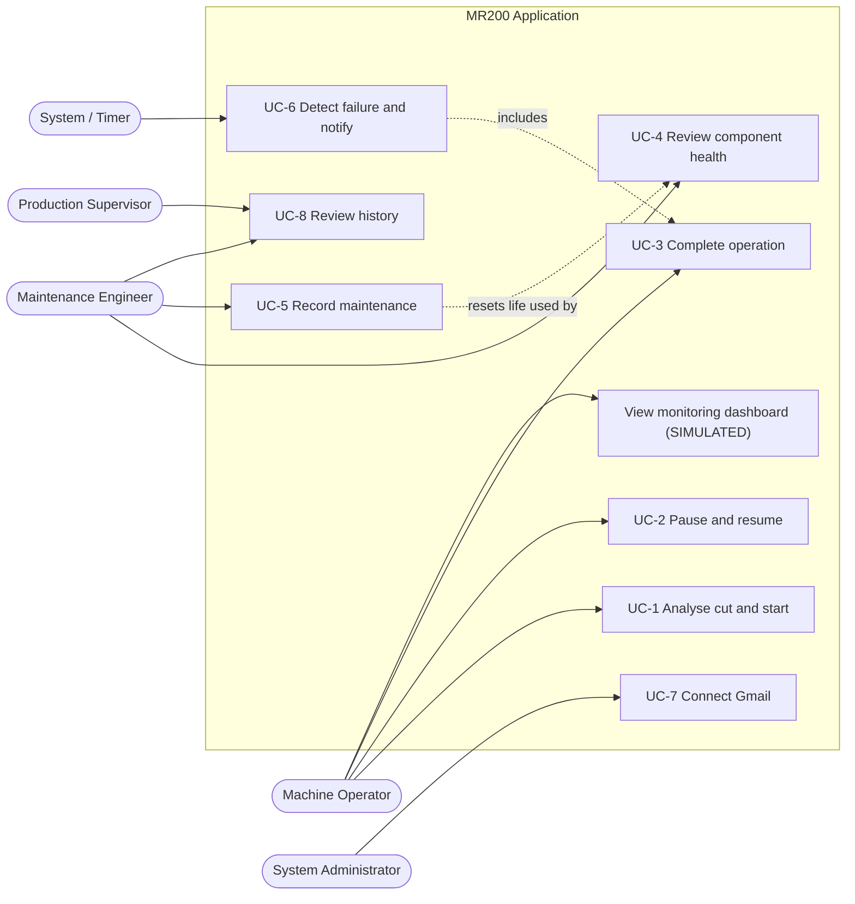
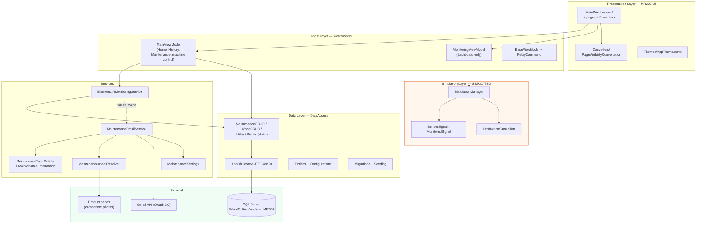
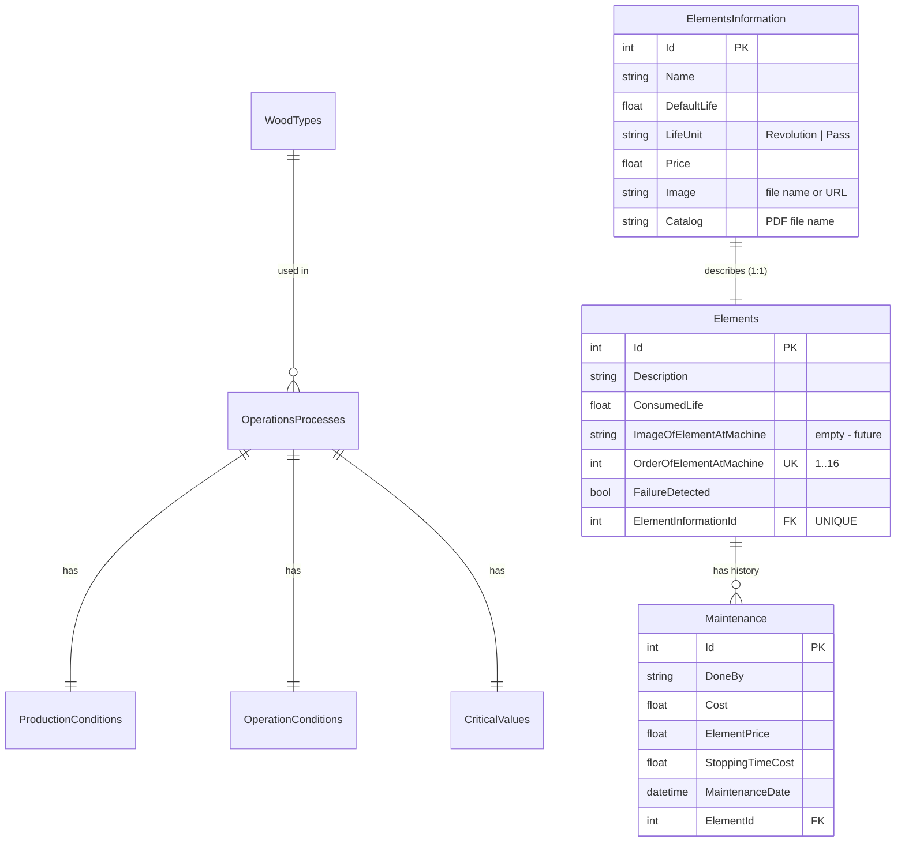
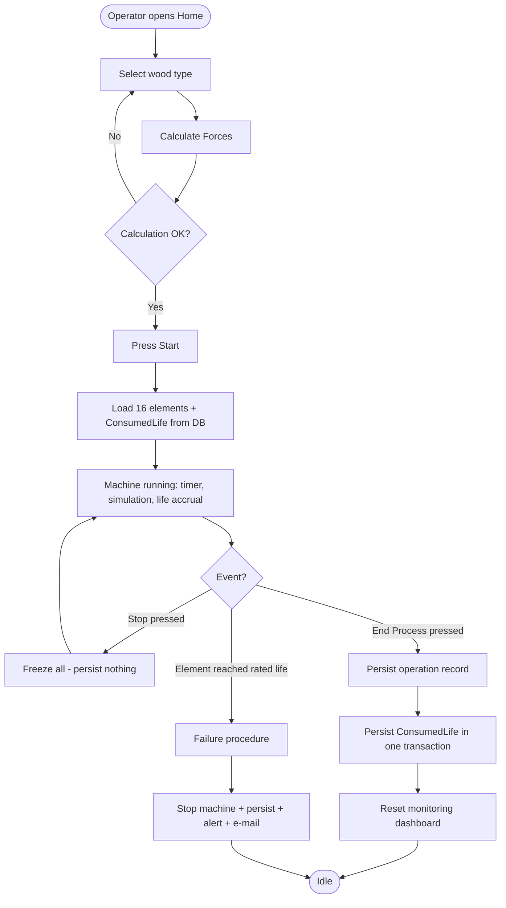
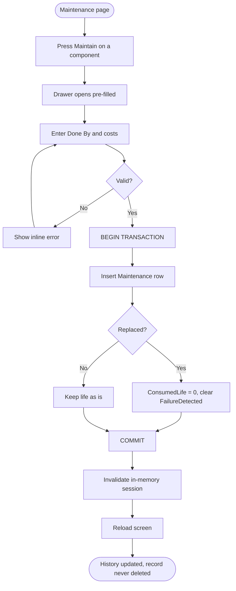
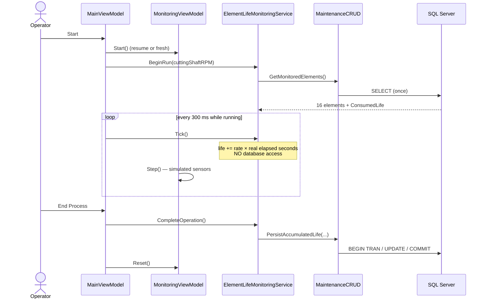
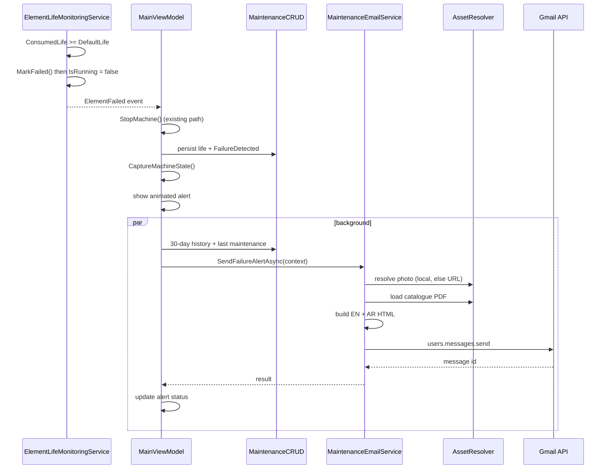
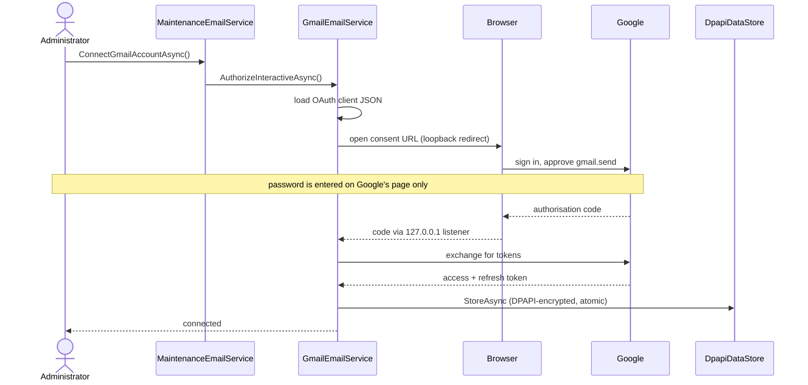

# MR200 Maintenance Monitoring System
## Software System Analysis and Functional Specification

**Document version:** 1.0
**Date:** 28 August 2026
**Applies to:** MR200 slicing-machine desktop application (branch `maintenance-predictive-system`)
**Repository:** https://github.com/GithubGhayath/Automating-slicing-machine-new-UI-new

> **How to read the status labels.** Every feature in this document carries one of three labels.
> They are not decorative — they are the single most important thing in this specification.
>
> | Label | Meaning |
> |---|---|
> | **REAL / IMPLEMENTED** | The code performs the actual operation. Data is persisted, sent, or computed for real. |
> | **SIMULATED** | The value is generated by software. It does **not** come from any sensor, PLC, or physical machine. |
> | **PLANNED / FUTURE** | Visible in the UI as a placeholder, or required for a hardware deployment, but not implemented. |
>
> **The MR200 application is not connected to any physical hardware.** There is no PLC driver, no
> serial/Modbus/OPC-UA client, no sensor input of any kind anywhere in the codebase. Every number
> shown on the Monitoring panel is generated inside the application.

---

## 1. Introduction

The MR200 is a wood-slicing machine. This application is the desktop software that accompanies it.
It performs three distinct jobs:

1. **Cutting-force analysis** — computes the mechanical forces of a cut from wood properties and
   machine geometry, and records each production operation.
2. **Machine monitoring** — presents an operator dashboard of live-looking machine signals.
3. **Predictive maintenance** — tracks how much service life each physical component has consumed,
   stops the machine when one reaches end of life, and e-mails the maintenance department.

This document describes what the software **currently does**, in enough plain language for a
mechanical engineer or evaluator to follow, and in enough technical detail for a software agent to
modify it safely.

### 1.1 The single most important distinction in this system

The application contains **two entirely separate things that both look like "monitoring"**. They are
frequently confused. They share no data.

| | **Monitoring Panel** | **Predictive Maintenance** |
|---|---|---|
| Status | **SIMULATED** | **REAL / IMPLEMENTED** |
| Data source | `SimulationManager` — random stochastic process | Configured machine constants + real elapsed time |
| Persisted? | No. Everything is lost on reset. | Yes. Written to SQL Server. |
| Randomness | Yes (seeded Gaussian noise + spikes) | No. Fully deterministic. |
| Drives any decision? | No. Charts only. | Yes. Stops the machine, sends e-mail. |
| Code | `MR200.UI/Simulation/` | `MR200.UI/MaintenanceSystem/` |

**`SimulationManager` values never reach the maintenance system, and maintenance values never reach
the charts.** An agent modifying one must not assume it affects the other.

---

## 2. System Purpose

To give the operator and the maintenance department a single application that:

- calculates the cutting mechanics of a planned operation before it runs;
- shows machine behaviour while a production operation is in progress;
- keeps a permanent, per-component record of consumed service life;
- warns before a component fails, and stops the machine when one does;
- records the cost and history of every maintenance action.

The maintenance half exists because bearings and belts fail on a predictable duty cycle. Tracking
consumed life against the manufacturer's rated life allows replacement to be scheduled instead of
discovered.

---

## 3. System Objectives

| # | Objective | Status |
|---|---|---|
| O1 | Compute cutting forces from wood properties and blade geometry | REAL |
| O2 | Persist every completed production operation with its conditions | REAL |
| O3 | Present a historical dashboard of past operations | REAL |
| O4 | Present a live machine-monitoring dashboard | SIMULATED |
| O5 | Track consumed service life per physical component | REAL |
| O6 | Detect end of life and stop the machine automatically | REAL |
| O7 | Notify the maintenance department by e-mail | REAL |
| O8 | Record maintenance actions and their costs | REAL |
| O9 | Acquire values from real sensors / PLC | PLANNED / FUTURE |
| O10 | Live camera view of the cutting area | PLANNED / FUTURE |

---

## 4. Stakeholders and Users

The application has **no authentication and no user accounts**. There is no login screen, no roles,
and no permission model. Every person using the machine has access to every screen.

The roles below are therefore *functional* roles, not enforced software roles.

| Role | What they use the system for |
|---|---|
| **Machine Operator** | Selects wood, calculates forces, runs Start / Stop / End Process, watches the Monitoring panel |
| **Maintenance Engineer** | Reads component health, records maintenance and replacements, receives alert e-mails |
| **Production Supervisor** | Reviews the History dashboard: volumes, costs, energy, force trends |
| **System Administrator** | One-time Gmail OAuth setup, `App.config` tuning, database availability |
| **Project Supervisor / Evaluator** | Reviews the system as an academic deliverable |

> **Note for the thesis:** the absence of authentication is a genuine limitation, listed in §24.

---

## 5. System Scope

### 5.1 In scope (implemented)

- WPF desktop application, Windows only, single window, four pages
- SQL Server database via Entity Framework Core 9 (code-first, migrations)
- Cutting-force and machine-geometry calculations
- Production history with charts and PDF export
- Simulated machine-monitoring dashboard
- Predictive maintenance: 16 tracked components, life accounting, failure detection, automatic stop
- Bilingual (English + Arabic) HTML alert e-mail via the Gmail API with OAuth 2.0

### 5.2 Out of scope (not implemented)

- Any communication with the physical MR200 machine
- Sensor, PLC, Modbus, OPC-UA, serial or network acquisition
- Camera / vision
- User accounts, authentication, authorisation
- Multi-machine or multi-site operation
- Web, mobile, or remote access
- Automatic scheduling of maintenance work orders

---

## 6. Current System Status

| Subsystem | Status | Notes |
|---|---|---|
| Home page — force calculation | **REAL** | Deterministic physics from `App.config` + wood properties in DB |
| Machine Start / Stop / End Process | **REAL** | Real WPF timers and state; no motor is actually controlled |
| Production history + PDF export | **REAL** | Persisted to SQL Server, exported with QuestPDF |
| Monitoring panel — all charts and sensor values | **SIMULATED** | `SimulationManager`; the page itself says so on screen |
| Monitoring panel — camera view | **PLANNED / FUTURE** | Static "Camera is currently offline" placeholder; no code behind it |
| Element life tracking | **REAL** | Deterministic model, persisted, survives restart |
| End-of-life detection and automatic stop | **REAL** | Reuses the existing stop path |
| Failure alert e-mail | **REAL** | Genuinely delivered via Gmail API |
| Maintenance recording and life reset | **REAL** | Transactional |
| Machine-position photographs of components | **PLANNED / FUTURE** | Column exists, deliberately empty |

---

## 7. Functional Requirements

### 7.1 Production and analysis

| ID | Requirement | Status |
|---|---|---|
| FR-1 | Operator selects a wood type from the database | REAL |
| FR-2 | System computes friction/shear angles, chip thickness, and seven force components | REAL |
| FR-3 | System plots cutting force and shaft moment against chip thickness | REAL |
| FR-4 | Operator starts, stops (pauses) and ends a production operation | REAL |
| FR-5 | Completing an operation persists its conditions, forces and costs | REAL |
| FR-6 | History page aggregates past operations into KPIs and charts | REAL |
| FR-7 | Any past operation can be exported as a PDF report | REAL |

### 7.2 Monitoring

| ID | Requirement | Status |
|---|---|---|
| FR-8 | Dashboard shows cutting-shaft torque over time | SIMULATED |
| FR-9 | Dashboard shows feed-shaft torque over time (4 shafts) | SIMULATED |
| FR-10 | Dashboard shows conveyor belt speeds | SIMULATED |
| FR-11 | Dashboard shows cumulative production and rate | SIMULATED |
| FR-12 | Dashboard shows current / max / average per signal | SIMULATED |
| FR-13 | Dashboard shows machine state and operating time | REAL state, SIMULATED elapsed clock |
| FR-14 | Dashboard shows a live camera feed | PLANNED / FUTURE |

### 7.3 Predictive maintenance

| ID | Requirement | Status |
|---|---|---|
| FR-15 | System tracks 16 physical components individually | REAL |
| FR-16 | Consumed life accumulates only while the machine runs | REAL |
| FR-17 | Pausing must not persist accumulated life | REAL |
| FR-18 | Completing an operation persists accumulated life | REAL |
| FR-19 | Consumed life survives application restart | REAL |
| FR-20 | Reaching rated life stops the machine automatically | REAL |
| FR-21 | Each component raises at most one failure event | REAL |
| FR-22 | Failure sends a bilingual e-mail with catalogue and photo | REAL |
| FR-23 | Components above a configurable threshold are reported as approaching failure | REAL |
| FR-24 | Maintenance actions are recorded with costs and never deleted | REAL |
| FR-25 | Replacing a component resets its life to zero | REAL |

---

## 8. System Use Cases

Only use cases that exist in the current code are listed.

---

### UC-1 — Analyse a cut and start production

- **Actor:** Machine Operator
- **Goal:** Compute the mechanics of a cut and begin a production operation
- **Precondition:** SQL Server reachable; wood types seeded
- **Main flow:**
  1. Operator opens **Home**.
  2. Selects a wood type; the system loads its shear yield stress, specific work and friction coefficient.
  3. Presses **Calculate Forces**. The system reads machine geometry from `App.config`, computes angles, chip thickness and the seven force components, fills both tables and both charts.
  4. Presses **Start**. Timer begins, monitoring simulation begins, element life monitoring begins.
- **Alternative flow:** No wood selected → *Calculate Forces* stays disabled. Database unreachable → the wood list is empty (failure is swallowed silently — see §24).
- **Result:** Machine is in the running state; all three subsystems are advancing.

---

### UC-2 — Pause and resume a production operation

- **Actor:** Machine Operator
- **Goal:** Interrupt a run without losing its progress
- **Precondition:** A run is in progress
- **Main flow:**
  1. Operator presses **Stop**. Machine timer freezes, monitoring freezes, life accumulation freezes. **Nothing is written to the database.**
  2. Operator presses **Start** again. All three resume from where they stopped; the paused interval is excluded from the elapsed time.
- **Result:** The operation continues as one continuous run.

---

### UC-3 — Complete a production operation

- **Actor:** Machine Operator
- **Goal:** Finish a run and commit its results
- **Precondition:** A run is in progress or paused
- **Main flow:**
  1. Operator presses **End Process**.
  2. The system persists an `OperationsProcess` row with its production, operating and critical-value records.
  3. The accumulated element life is added onto each component's persistent `ConsumedLife` in a single transaction.
  4. The monitoring dashboard resets to Standby and clears its charts.
- **Alternative flow:** If persisting the production record throws, it is caught and ignored; element life is still persisted (the two are independent).
- **Result:** Operation is in history; component life is permanently updated.

---

### UC-4 — Review component health

- **Actor:** Maintenance Engineer
- **Goal:** See which components are nearing end of life
- **Main flow:**
  1. Engineer opens **Maintenance**.
  2. The system loads all 16 components with their consumed, rated and remaining life, life-used percentage and status (Normal / Warning / Critical / Failed).
  3. Health counters and the most-worn / freshest component are summarised.
- **Note:** While a run is in progress the screen shows live in-memory values (persisted + not-yet-saved); otherwise it reads from the database.
- **Result:** Engineer can plan replacement.

---

### UC-5 — Record a maintenance or replacement action

- **Actor:** Maintenance Engineer
- **Goal:** Log work performed on a component
- **Main flow:**
  1. Engineer presses **Maintain** on a component row.
  2. A drawer opens pre-filled with the component name and its catalogue price.
  3. Engineer enters who performed the work, the service cost, the element price and the stopping-time cost, and confirms whether the component was replaced.
  4. On **Save Maintenance**, the system writes a `Maintenance` row and — if replaced — resets `ConsumedLife` to 0 and clears the failure latch, both inside one transaction.
- **Alternative flow:** Missing "Done By" or non-numeric costs → an inline error, nothing saved.
- **Result:** Maintenance history grows; the record is never deleted, even after replacement.

---

### UC-6 — Automatic failure detection and notification

- **Actor:** System (no human trigger)
- **Goal:** Protect the machine and inform maintenance
- **Precondition:** A run is in progress; some component's consumed life reaches its rated life
- **Main flow:**
  1. The monitoring tick detects `ConsumedLife >= DefaultLife`.
  2. The component is latched as failed so the event cannot repeat.
  3. The machine is stopped through the application's existing stop path.
  4. Accumulated life and the failure latch are written to the database.
  5. The machine's condition at that instant is captured.
  6. An animated alert appears on screen.
  7. In the background: maintenance history is loaded, the component photo downloaded, the catalogue attached, and a bilingual HTML e-mail sent.
- **Alternative flow:** E-mail cannot be sent → the machine still stops, the alert still appears, and the rendered e-mail is saved to `Desktop\Reports\MaintenanceAlerts\`.
- **Result:** Machine stopped, exactly one alert raised, department notified.

---

### UC-7 — Connect the Gmail account

- **Actor:** System Administrator
- **Goal:** Authorise the application to send alert e-mails
- **Precondition:** A Google Cloud OAuth *Desktop app* client JSON exists at `%LOCALAPPDATA%\MR200\credentials.json`
- **Main flow:**
  1. Administrator triggers the connect operation.
  2. The system opens Google's consent screen in the default browser and listens on a loopback port.
  3. Administrator signs in **on Google's page** and approves the single `gmail.send` permission.
  4. The refresh token is encrypted with Windows DPAPI and stored outside the repository.
- **Alternative flow:** Consent denied, account not a listed test user, or wrong client type → a specific, human-readable diagnosis is returned.
- **Result:** All later alerts send silently with no browser and no person present.

> **Important:** as of this version there is **no button for this in the user interface**. See §17.4.

---

### UC-8 — Review production history

- **Actor:** Production Supervisor
- **Goal:** Understand output, cost and energy trends
- **Main flow:** Opens **History**; the system loads all operations and computes KPIs, a production trend with moving average, a wood-type pie chart, a force-comparison column chart and a force radar. Any row can be opened in a detail drawer or exported to PDF.
- **Result:** Supervisor has an aggregate view.

---

## 9. Use Case Diagram



---

## 10. Overall System Architecture

### 10.1 Architecture actually used

The project uses **MVVM within a two-project layered solution**. The following are **present**:

- **MVVM** — views in XAML, one `MainViewModel` plus one `MonitoringViewModel`, `INotifyPropertyChanged` via `BaseViewModel`, `ICommand` via `RelayCommand`.
- **Layered separation** — `DataAccess` (entities, EF configuration, migrations, seeding) and `MR200.UI` (presentation, services, simulation).
- **Entity Framework Core 9, code-first** with migrations and `IEntityTypeConfiguration<T>` classes.
- **Rich domain entities** — private setters, private parameterless constructors, behaviour methods (`AccumulateLife`, `ResetLifeAfterReplacement`).
- **Service classes** for maintenance, e-mail and simulation.

The following are **deliberately NOT present** — an agent must not assume them:

- ❌ **No dependency-injection container.** No `IServiceCollection`, no constructor injection. The view model is instantiated declaratively in XAML (`<vm:MainViewModel/>`), and services are `static` classes or `new`-ed directly.
- ❌ **No repository interfaces / Unit of Work.** Data access is via **static classes** (`WoodCRUD`, `Utility`, `Binder`, `MaintenanceCRUD`) that each create and dispose their own `AppDbContext`.
- ❌ **No MVVM framework** (no Prism, MVVM Toolkit, ReactiveUI). `BaseViewModel` and `RelayCommand` are hand-written.
- ❌ **No navigation service.** Navigation is a `string` property plus value converters.
- ❌ **No logging framework.** Errors surface as UI strings or are swallowed.
- ❌ **No unit-test project** in the repository.

### 10.2 Layer diagram



> Note the absence of any arrow between the **Simulation Layer** and the **Data Layer**. That gap is
> intentional and is the defining structural fact of this system.

### 10.3 Projects

| Project | Target | Role |
|---|---|---|
| `DataAccess` | `net9.0` | Entities, EF configuration, migrations, seed data. No UI dependency. |
| `MR200.UI` | `net9.0-windows` (WPF) | Everything else: views, view models, services, simulation. |

### 10.4 Key dependencies

| Package | Version | Used for |
|---|---|---|
| `Microsoft.EntityFrameworkCore.SqlServer` | 9.0.* | ORM and SQL Server provider |
| `Microsoft.EntityFrameworkCore.Design/Tools` | 9.0.* | Migrations |
| `LiveChartsCore.SkiaSharpView.WPF` | 2.* | All charts |
| `QuestPDF` | 2024.* | Production PDF reports |
| `Google.Apis.Gmail.v1` | 1.75.0.4225 | Gmail API + OAuth |
| `MimeKit` | 4.17.0 | MIME construction (HTML, inline images, attachments) |
| `System.Security.Cryptography.ProtectedData` | 10.0.11 | DPAPI token encryption |
| `System.Configuration.ConfigurationManager` | 10.0.9 | Reading `App.config` |

---

## 11. Monitoring Panel

> ## ⚠ Status: SIMULATED
> Every value on this page is generated by `MR200.UI/Simulation/SimulationManager.cs`.
> None of it originates from a sensor, PLC, encoder, or the physical MR200.
> The page states this itself in its own subtitle:
> *"Live operator view — all sensor values are simulated until PLC integration."*

### 11.1 Purpose

To give the operator a single glance at machine behaviour during a run: shaft loading, belt speed,
production rate and overall state. In the current build it demonstrates the intended operator
experience; in a hardware deployment the same layout would display real acquired values.

### 11.2 Navigation note (important for agents)

The sidebar item is labelled **"Monitoring"**, but the internal page key is still **`"Charts"`**.
`CurrentPage == "Charts"` selects this page, and the title bar therefore displays "Charts". This is
inherited from the upstream repository and is intentional. Renaming the key requires changing the
`RadioButton` `CommandParameter`, the `ConverterParameter`, and the page's `PageVis` parameter together.

### 11.3 Dashboard areas

| # | Area | Contents | Status |
|---|---|---|---|
| 1 | Header | Title, subtitle, state badge, operating time | State REAL, clock SIMULATED |
| 2 | Cutting Shaft Torque | Line chart, 2 series + live statistics | SIMULATED |
| 3 | Production Rate | Filled area chart of cumulative slices + 4 figures | SIMULATED |
| 4 | Conveyor Belt Speed | Line chart, input/output + statistics | SIMULATED |
| 5 | Feed Shaft Torque | Line chart, 4 series + statistics | SIMULATED |
| 6 | Camera Monitoring | Static "OFFLINE" placeholder | **PLANNED / FUTURE** |
| 7 | Machine Status | State, operating time, feed rate, production totals | Mixed |

### 11.4 Value trace — every displayed number

The generic path for **all** monitoring values is identical:

```text
DispatcherTimer (300 ms, in MonitoringViewModel)
        ↓
MonitoringViewModel.Step()
        ↓
SimulationManager.Tick(dt = 0.30 s)
        ↓
SensorSignal.Tick()  — mean-reverting stochastic process
        ↓
MonitoredSignal records Current / Max / Average
        ↓
ObservablePoint appended to the chart buffer  +  SignalStatRow.Update(...)
        ↓
LiveCharts renders; sliding X window advances
```

Concrete instances:

| UI element | Source object | Generation | Update | Displayed as |
|---|---|---|---|---|
| Cutting Shaft A torque | `SimulationManager.CuttingShaftA` | `SensorSignal` mean 55 N·m | 300 ms tick | Chart line + Current/Max/Avg |
| Cutting Shaft B torque | `SimulationManager.CuttingShaftB` | mean 58 N·m | 300 ms tick | Chart line + Current/Max/Avg |
| Feed Shaft 1–4 torque | `SimulationManager.FeedShafts[0..3]` | means 22 / 25 / 20 / 24 N·m | 300 ms tick | Chart lines + statistics |
| Input Conveyor speed | `SimulationManager.InputConveyor` | mean = `FeedVelocity` (11 m/min) | 300 ms tick | Chart line + statistics |
| Output Conveyor speed | `SimulationManager.OutputConveyor` | mean = `FeedVelocity × 1.02` | 300 ms tick | Chart line + statistics |
| Current production rate | `ProductionSimulation.CurrentRate` | mean = feed ÷ 0.2 m = 55 slices/min | 300 ms tick | `ProdCurrent` |
| Total production | `ProductionSimulation.Total` | integral of rate × dt | 300 ms tick | `ProdTotal` + area chart |
| Average rate | `ProductionSimulation.AverageRate` | Total ÷ ElapsedMinutes | 300 ms tick | `ProdAvg` |
| Operating time | `SimulationManager.ElapsedSeconds` | accumulated `dt`, **not wall clock** | 300 ms tick | `ElapsedTime` |
| State badge | `SimulationManager.State` | set by Start/Pause/Reset | on transition | `StateText` / `StateColor` |
| Feed rate caption | `App.config` `FeedVelocity` | read once at construction | never | `FeedRateText` |
| Camera panel | — | nothing; static XAML | never | "Camera is currently offline." |

> **Operating-time caveat:** the monitoring clock counts `Dt = 0.30 s` per tick, not real elapsed
> time. If the UI thread stalls, this clock drifts behind the wall clock. It is independent of the
> Home-page machine timer and of the maintenance life clock, which **does** use real elapsed time.

### 11.5 Charts

Four `CartesianChart` controls. Each owns **its own** `Axis` instances — LiveCharts misbehaves if an
axis object is shared. Series are created once in `BuildSeries()`; only the point collections mutate,
so LiveCharts updates incrementally.

| Chart | Y range | Series |
|---|---|---|
| Cutting Shaft Torque | 0 – 140 N·m (fixed) | 2 |
| Production | 0 – auto | 1 (filled) |
| Conveyor Speed | feed ± 4 m/min (fixed) | 2 |
| Feed Shaft Torque | 0 – 60 N·m (fixed) | 4 |

Fixed Y ranges are deliberate: auto-scaling caused label reflow and visible layout jitter.

The X axis is a **20-second sliding window** (`WindowSeconds = 20`) advanced every tick by
`SlideWindow()`, with `MinStep = 4` and `ForceStepToMin = true` so tick labels stay stable. Each
buffer is capped at `MaxPoints = 140` points; the oldest is discarded.

### 11.6 Animations

- Chart lines glide with `AnimationsSpeed = 320 ms` and `LineSmoothness = 0.6`.
- The page fade/slide-in comes from the shared `AnimatedPage` style.
- No other animation exists on this page.

### 11.7 Thresholds and alerts on this page

**There are none.** The Monitoring panel has **no** thresholds, no warning levels, no alarms and no
predictive logic. The only status text is derived from machine state, not from any value:

| Machine state | Status shown | Colour |
|---|---|---|
| Running | `● Online` | `#10B981` |
| Running, signal disabled | `● Fault` | `#EF4444` |
| Paused | `❚❚ Paused` | `#C89B3C` |
| Standby | `○ Standby` | `#848283` |

`SensorSignal.Enabled` is the only way to produce "Fault" — it exists in the model but **nothing in
the current UI or logic ever sets it to false**, so "Fault" is unreachable today. All threshold-based
alerting in this system lives in the maintenance subsystem (§16), not here.

---

## 12. Simulation System

> ## ⚠ Status: SIMULATED — this entire section describes generated data

### 12.1 What is simulated

Nine independent signals plus a production model:

- 2 × cutting-shaft torque
- 4 × feed-shaft torque
- 2 × conveyor belt speed
- 1 × production rate (and its integral, total production)

### 12.2 How values are generated

Values are **not** per-tick random numbers. Each signal is a discretised
**Ornstein–Uhlenbeck (mean-reverting) process** with additive transient spikes, implemented in
`SensorSignal.Tick(dt)`:

```text
value += theta * (mean - value) * dt  +  sigma * sqrt(dt) * N(0,1)
value clamped to [min, max]

with probability (spikeChancePerSecond * dt):
    spike += spikeMagnitude * (0.5 + U(0,1))
spike *= exp(-2.5 * dt)                      // exponential decay

reading = value + spike, clamped to [min, max * 1.35]
```

Properties this produces, and why it was chosen over `Random.NextDouble()`:

- **Inertia** — the value drifts back toward its operating mean rather than jumping.
- **Natural fluctuation** — Gaussian noise via Box–Muller (`NextGaussian()`).
- **Occasional load spikes** that decay away, imitating a knot in the wood.
- **Bounded range** — readings stay physically plausible.

Every signal is constructed with a **fixed integer seed**, so a run is reproducible.

### 12.3 Simulation parameters (actual values from `SimulationManager`)

| Signal | Mean | θ (inertia) | σ (volatility) | Min | Max | Spike/s | Spike size | Seed |
|---|---|---|---|---|---|---|---|---|
| Cutting Shaft A | 55 N·m | 0.9 | 6.5 | 30 | 90 | 0.07 | 45 | 101 |
| Cutting Shaft B | 58 N·m | 0.8 | 7.0 | 32 | 95 | 0.06 | 50 | 202 |
| Feed Shaft 1 | 22 N·m | 1.0 | 3.0 | 12 | 40 | 0.05 | 18 | 311 |
| Feed Shaft 2 | 25 N·m | 0.9 | 3.4 | 14 | 44 | 0.05 | 20 | 322 |
| Feed Shaft 3 | 20 N·m | 1.1 | 2.8 | 11 | 38 | 0.04 | 16 | 333 |
| Feed Shaft 4 | 24 N·m | 0.95 | 3.2 | 13 | 42 | 0.05 | 19 | 344 |
| Input Conveyor | 11 m/min¹ | 1.4 | 0.25 | 9.8 | 12.2 | 0.015 | 0.8 | 411 |
| Output Conveyor | 11.22 m/min¹ | 1.3 | 0.28 | 10.0 | 12.4 | 0.015 | 0.9 | 422 |
| Production rate | 55 slices/min² | 0.6 | 6 %·mean | 75 %·mean | 115 %·mean | 0.02 | 10 %·mean | 511 |

¹ Derived from `App.config` → `FeedVelocity` (default 11 m/min), not invented.
² `FeedVelocity ÷ 0.2 m` product length = 55 slices/min at stock configuration.

### 12.4 Parameter summary table (as requested)

| Parameter | Current source | Simulation? | Update mechanism | Threshold | UI location |
|---|---|---|---|---|---|
| Cutting shaft torque A/B | `SensorSignal` | **Yes** | 300 ms `DispatcherTimer` | none | Monitoring → Cutting Shaft Torque |
| Feed shaft torque 1–4 | `SensorSignal` | **Yes** | 300 ms timer | none | Monitoring → Feed Shaft Torque |
| Conveyor speed in/out | `SensorSignal` | **Yes** | 300 ms timer | none | Monitoring → Conveyor Belt Speed |
| Production rate / total | `ProductionSimulation` | **Yes** | 300 ms timer | none | Monitoring → Production Rate |
| Monitoring operating time | accumulated `dt` | **Yes** | 300 ms timer | none | Monitoring header + status card |
| Machine state | `Start/Pause/Reset` | No (real state) | on button press | n/a | Monitoring state badge |
| Feed rate caption | `App.config` | No | read once | n/a | Conveyor description |
| Camera feed | — | n/a | none | n/a | Static offline placeholder |
| **Element consumed life** | **config × real time** | **No** | **300 ms machine timer** | **80 % / 95 % / 100 %** | **Maintenance page** |
| **Cutting shaft RPM** | **`clsMainEquations`** | **No** | **on Calculate Forces** | n/a | **Home page** |

### 12.5 Simulation lifecycle

| Operation | Trigger | Effect |
|---|---|---|
| `Start()` | Home **Start** button | State → Running; timer starts. **Resumes**, does not clear. |
| `Pause()` | Home **Stop** button | State → Paused; timer stops. All values retained. |
| `Reset()` | Home **End Process** button | State → Standby; every signal, statistic, chart buffer and counter cleared to zero. |
| `Tick(dt)` | 300 ms timer | Returns immediately unless Running. |

There is **no separate control for the simulation** — no start/stop/reset button on the Monitoring
page itself, and **no user-adjustable simulation parameters**. The dashboard is driven entirely by
the Home page's machine buttons. Changing simulation behaviour today requires editing
`SimulationManager`'s constructor.

### 12.6 How simulation would be replaced by real hardware

The seam is deliberate and narrow. `MonitoredSignal` wraps a `SensorSignal` and exposes
`Current / Max / Average / Online`. To use real data, feed live readings into `MonitoredSignal`
instead of calling `SensorSignal.Tick(dt)`. Charts, statistics rows, axes and the whole UI stay
unchanged. See §25.

---

## 13. Maintenance Management

> ## Status: REAL / IMPLEMENTED

### 13.1 Purpose

To keep a permanent record of every maintenance and replacement action, with its cost, and to
reset component life when a part is replaced.

### 13.2 Maintenance screen contents

| Block | Contents |
|---|---|
| Machine specification cards | Blade configuration and operating parameters from `App.config`; a maintenance-status card bound to live counts |
| Predictive Element Health | Counters — Monitored / Warning / Critical / Failed — plus warning threshold, refresh button, most-worn and freshest component |
| Monitored Elements table | One row per component (16): position #, element, type, machine position, consumed / rated / remaining life, life-used bar and %, status pill, last maintenance, **Maintain** button |
| Maintenance History table | Every recorded action: element, type, position, date, done by, service cost, element price, stopping-time cost, total. Shows "No previous maintenance record is available." when empty |

### 13.3 Recording an action

`RecordMaintenance(elementId, doneBy, cost, elementPrice, stoppingTimeCost, date, resetConsumedLife)`
executes inside an explicit transaction:

1. Load the element.
2. Add a `Maintenance` row through the navigation collection.
3. If `resetConsumedLife` — call `ResetLifeAfterReplacement()`, which sets `ConsumedLife = 0` **and**
   clears `FailureDetected`.
4. `SaveChanges()` then `Commit()`; any exception rolls back.

Afterwards the view model calls `_lifeMonitor.InvalidateSession()` so the next run reloads the
corrected counters from the database rather than continuing from stale memory.

**Maintenance rows are never deleted by the application.** Replacing a component preserves its full
history.

### 13.4 Not implemented

There is **no edit and no delete** for maintenance records, and **no add/edit/delete for components**.
The 16 components are fixed by seed data. There is no search, filter or sort beyond the default
ordering. Adding these would be new development.

---

## 14. Component / Element Management

> ## Status: REAL / IMPLEMENTED (fixed set, seeded)

### 14.1 The 16 monitored components

`OrderOfElementAtMachine` is the number an operator uses to find the part physically.

| # | Type | Position | Rated life | Price |
|---|---|---|---|---|
| 1 | Bearing 16009 | Feeding shaft 1 (first from right) — shaft end | 4,492,100,000 rev | $47 |
| 2 | Bearing 16009 | Feeding shaft 1 — next to #1 | 4,492,100,000 rev | $47 |
| 3 | Bearing 16009 | Feeding shaft 2 — shaft end | 4,492,100,000 rev | $47 |
| 4 | Bearing 16009 | Feeding shaft 2 — next to #3 | 4,492,100,000 rev | $47 |
| 5 | Bearing 16009 | Feeding shaft 3 — shaft end | 4,492,100,000 rev | $47 |
| 6 | Bearing 16009 | Feeding shaft 3 — next to #5 | 4,492,100,000 rev | $47 |
| 7 | Bearing 16009 | Feeding shaft 4 — shaft end | 4,492,100,000 rev | $47 |
| 8 | Bearing 16009 | Feeding shaft 4 — next to #7 | 4,492,100,000 rev | $47 |
| 9 | Bearing 16007 | Top cutting shaft | 2,197,000,000 rev | $31 |
| 10 | Bearing 16008 | Top cutting shaft | 2,628,100,000 rev | $36 |
| 11 | Bearing 16007 | Bottom cutting shaft | 2,197,000,000 rev | $31 |
| 12 | Bearing 16008 | Bottom cutting shaft | 2,628,100,000 rev | $36 |
| 13 | A46 V-Belt | Drives feeding shaft 1 | 288,000,000 passes | $10 |
| 14 | A46 V-Belt | Drives feeding shaft 2 | 288,000,000 passes | $10 |
| 15 | A46 V-Belt | Drives feeding shaft 3 | 288,000,000 passes | $10 |
| 16 | A46 V-Belt | Drives feeding shaft 4 | 288,000,000 passes | $10 |

Rated lives were supplied by the project's mechanical analysis (bearing L10 life); they are not
computed by the software.

### 14.2 Life units are not interchangeable

Bearings are rated in **revolutions**; belts in **passes** (one full circuit of the belt loop).
`enElementLifeUnit` enforces the distinction and the two are never added or compared.

### 14.3 Catalogues and photographs

| Asset | Storage | Status |
|---|---|---|
| Manufacturer catalogue | File name in `ElementsInformation.Catalog`, PDF deployed under `MaintenanceAssets/Catalogs/` | REAL — 4 SKF PDFs present |
| Component photograph | `ElementsInformation.Image` — a local file name **or** an http(s) URL | REAL, with a caveat below |
| Machine-position photograph | `Elements.ImageOfElementAtMachine` | **PLANNED / FUTURE** — deliberately empty |

`MaintenanceAssetResolver` resolves a photograph by trying a local file first
(`MaintenanceAssets/Images/`, or an absolute path) and only then treating the value as a URL, in
which case it fetches the page and extracts the `og:image`/`twitter:image` metadata.

**Known limitation, verified against the live sites:**

| Element | Source | Result |
|---|---|---|
| Bearing 16007 | nskbearingcatalogue.com | ✔ resolves |
| A46 V-Belt | dieselbelting.com | ✔ resolves |
| Bearing 16009 | amazon.it | ✘ blocked by bot protection |
| Bearing 16008 | nl.rs-online.com | ✘ blocked by bot protection |

A missing photograph never blocks an alert; the e-mail states that it is unavailable.

---

## 15. Maintenance Life Tracking

> ## Status: REAL / IMPLEMENTED
> The *code* is real, persistent and deterministic. Note carefully, though, that the **machine speeds
> it multiplies by are configuration constants, not measured values** — see §15.5.

### 15.1 Life accumulation model

Life is always `rate × real elapsed seconds`, computed from the wall clock:

```text
elapsedSeconds = now - lastTick          (real time, clamped: ignored if <= 0 or > 60 s)
lifeAdded      = ratePerSecond * elapsedSeconds
```

This is deliberately **independent of frame rate, timer interval and CPU speed**. It is not a
per-tick increment.

### 15.2 The three rates

| Component group | Positions | Rate | Source |
|---|---|---|---|
| Feed-shaft bearings | 1–8 | `FeedShaftSpeedRPM / 60` = **0.41667 rev/s** | `App.config` `FeedShaftSpeedRPM` = 25 |
| Cutting-shaft bearings | 9–12 | `RPM / 60` ≈ **58.207 rev/s** | The application's own `NumberOfRotations_Unit_RPM(...)` ≈ 3492.4 RPM |
| V-belts | 13–16 | `beltSpeed / pitchLength` = 0.371 / 1.2 = **0.30917 passes/s** | `App.config` `VBeltLinearSpeedMeterPerSecond`, `VBeltPitchLengthMillimeter` |

**Belt passes.** One pass is one complete circuit of the belt loop, so the belt travels its own pitch
length once per pass. The SKF PHG A46 has a 1200 mm pitch length, hence `0.371 m/s ÷ 1.2 m`.

**The cutting-shaft speed is never hard-coded.** It is read from the live calculation
(`MaxCuttingVelocity / (π × BladeDiameter)`), so changing blade diameter or cutting velocity in
`App.config` automatically changes how fast those bearings age.

### 15.3 Persistence lifecycle

| Machine action | Effect on element life |
|---|---|
| **Start** (RUN) | Loads all 16 elements and their persistent `ConsumedLife` from the database **once**, then begins accumulating in memory. If a session is already active (resume after Stop), it keeps what was accumulated and only resets the tick clock. |
| **Stop** (PAUSE) | Freezes the counters. **Nothing is written to the database.** |
| **End Process** | Adds accumulated life onto `ConsumedLife` in one transaction, then ends the session so the next Start reloads. |
| **Failure** | Persists immediately, so the failure survives a restart. |

The database is read **once per production operation** and written **once per production operation**.
Nothing queries it from inside the simulation loop.

### 15.4 Health classification

```text
LifeUsedPercentage = ConsumedLife / DefaultLife × 100
```

| Status | Condition | Colour |
|---|---|---|
| Normal | < warning threshold | `#10B981` |
| Warning | ≥ `PredictiveMaintenanceWarningThreshold` (default **80 %**) | `#C89B3C` |
| Critical | ≥ `PredictiveMaintenanceCriticalThreshold` (default **95 %**) | `#E05C1A` |
| Failed | ≥ 100 % **or** `FailureDetected` latched | `#EF4444` |

Thresholds are read from configuration in one place (`MaintenanceSettings`) and are never
hard-coded across the application.

### 15.5 Honest characterisation for the thesis

The life-tracking subsystem is **fully implemented software operating on a deterministic model**. It
is not a simulation in the stochastic sense — there is no randomness, and results are reproducible
and persistent. But it is also **not measurement**: the shaft speeds are configuration constants and
derived equations, not readings from an encoder or tachometer.

The correct description is therefore:

> Consumed life is computed from a validated kinematic model of the machine multiplied by real
> running time, and stored permanently. Replacing the configured speeds with measured speeds would
> make it a true condition-monitoring system without changing any of the surrounding logic.

### 15.6 A consequence worth knowing

At the real rated lives, nothing fails for years of running (a 16009 at 25 RPM would need roughly
340 years). End-of-life behaviour can therefore only be exercised by temporarily lowering a
`DefaultLife` value in the database. This is a property of the physics, not a defect.

---

## 16. Alerts and Notifications

> ## Status: REAL / IMPLEMENTED

### 16.1 Detection

On every machine tick, after life is accumulated, `DetectEndOfLife()` looks for the first component
where `ConsumedLife >= DefaultLife` and `FailureDetected` is not already set.

### 16.2 Single-event guarantee

Duplicate alerts are prevented at two levels:

1. **In memory** — the element is latched with `MarkFailed()` *before* the event is raised, so a
   re-entrant stop cannot raise it twice, and `IsRunning` is set false immediately.
2. **In the database** — `FailureDetected` is persisted, so the event does not repeat after an
   application restart. It is cleared only by recording a replacement.

### 16.3 Failure response sequence

1. Latch the component and stop accumulating.
2. Call the application's **existing** `StopMachine()` — the same code path as the Stop button. No
   parallel stop mechanism exists.
3. Persist accumulated life and the failure latch.
4. Capture machine condition (runtime, production, energy, speed, wood type).
5. Show the on-screen alert immediately.
6. Send the e-mail in the background.

### 16.4 On-screen alert

A full-screen animated overlay (not a message box), matching the application's design language:

- Pulsing hazard beacon (two expanding rings + fading warning glyph)
- Card scales in with a `BackEase`
- Red-to-orange gradient header, "MACHINE STOPPED AUTOMATICALLY" badge
- Life bar animated from 0 to 100 %
- Element figures, machine condition at failure, predictive summary
- Live e-mail status with a pulsing dot: preparing → sending → sent/failed
- Actions: **Open Maintenance** and **Dismiss**

### 16.5 Error containment

E-mail failure must never undo failure detection or the machine stop. `SendFailureAlertAsync` never
throws; it returns a result. If sending fails, the rendered HTML is written to
`Desktop\Reports\MaintenanceAlerts\` so the report is not lost.

---

## 17. Gmail Integration

> ## Status: REAL / IMPLEMENTED — e-mails are genuinely delivered

### 17.1 Why Gmail, and why the API rather than SMTP

The maintenance department is reachable at a Gmail address. SMTP with a password is **not** used and
is not supported: Google disabled password-based SMTP for consumer accounts in May 2022, and Gmail
App Passwords were unavailable for the project account. The application therefore uses the **Gmail
API with OAuth 2.0**, which is also the more secure design.

### 17.2 Credentials — the critical distinction

| | **Gmail account password** | **Google Cloud OAuth client** |
|---|---|---|
| What it is | The secret a *human* uses to sign in | A client id + secret identifying the *application* |
| Does the application ever see it | **Never** | Yes |
| What it grants alone | Full account access | **Nothing** until a human approves the consent screen |

**The application never requests, receives, handles or stores a Gmail password.** When authorisation
is needed the system opens **Google's own** sign-in page; the password is typed into Google, not into
this application. Google returns a token scoped to one narrow permission.

### 17.3 Secrets — locations only, values never reproduced

> No credential value appears in this document, in the source code, in `App.config`, in the database,
> or anywhere in version control.

| Artefact | Location | Protection |
|---|---|---|
| OAuth client JSON | `%LOCALAPPDATA%\MR200\credentials.json` | Outside the repository; git-ignored |
| OAuth refresh token | `%LOCALAPPDATA%\MR200\GmailToken\*.dat` | **DPAPI-encrypted**, `CurrentUser` scope |
| Recipient / sender address | `App.config` | Not secret — plain e-mail addresses |

`.gitignore` blocks `credentials.json`, `client_secret*.json`, `**/Credentials/`, `GmailToken/`,
`token.json`. Both artefacts live outside the repository anyway; the ignore rules are a second line
of defence.

### 17.4 Where the commands live — IMPORTANT, CURRENT STATE

The service methods **exist and work**:

- `MaintenanceEmailService.ConnectGmailAccountAsync(ct, onAuthorizationUrl)`
- `MaintenanceEmailService.DisconnectGmailAccountAsync()`

However, **`ConnectGmailCommand` and `DisconnectGmailCommand` no longer exist in `MainViewModel`, and
there is no Connect/Disconnect UI on the Maintenance screen.** They were present in an earlier
revision and were removed at the project owner's request, together with the status card that hosted
them. Authorisation is currently performed from an external console utility that calls the same
service methods.

> **For an agent restoring this UI:** add the two `RelayCommand`s back to `MainViewModel`, have them
> call the two service methods above, and bind them to buttons on the Maintenance page. The service
> layer needs no change. Do **not** invoke the interactive consent flow from the automatic alert
> path — see §17.7.

### 17.5 OAuth flow

- **Client type:** Desktop app (installed application). A *Web application* client fails with
  `redirect_uri_mismatch`.
- **Redirect:** loopback, `http://127.0.0.1:<random free port>/authorize/`, via
  `LocalServerCodeReceiver`. No redirect URI is configured manually.
- **Scope:** `https://www.googleapis.com/auth/gmail.send` — **only**. This is the narrowest scope
  that can send a message; it cannot read, search or delete mail.
- **`access_type=offline`** so a refresh token is issued.

The application wraps Google's receiver in `UrlReportingCodeReceiver` purely to surface the
authorisation URL before the browser launches, so a closed tab is recoverable.

### 17.6 Token storage

`DpapiDataStore` replaces Google's stock `FileDataStore`, which writes refresh tokens as **plain
JSON**. Instead the token is encrypted with Windows DPAPI (`DataProtectionScope.CurrentUser`) before
touching disk. Only the same Windows user on the same machine can decrypt it.

Writes are **atomic** — written to `.tmp` then moved into place — so a crash mid-write cannot leave a
half-written token. Blocking file attributes (`Hidden`, `ReadOnly`, `System`) are cleared before each
write.

> **Historical defect worth recording.** An earlier revision marked the token file `Hidden`. Windows
> refuses to recreate a hidden file through `FileMode.Create`, which `File.WriteAllBytes` uses. The
> first write succeeded, but **every token refresh** (roughly hourly) then failed with
> `UnauthorizedAccessException` during a send. The attribute was removed — DPAPI is what protects the
> file, not obscurity — and `RepairFileAttributes()` now heals files left over from that revision.

### 17.7 Interactive vs silent operation

| Path | Browser | When |
|---|---|---|
| `AuthorizeInteractiveAsync` | Opens consent screen | Explicit administrator action only |
| `TryGetCredentialAsync` | Never | Every automatic alert |

This split is deliberate and must be preserved: **a component failing at 03:00 must not block on a
browser window.** If no token is stored, the alert path reports it and saves the e-mail to disk
rather than prompting.

### 17.8 Sending

- MIME is built with **MimeKit**: HTML body, `cid:` inline images, file attachments.
- Encoded base64url and sent via `users.messages.send` with user id `"me"`.
- Gmail also files a copy in the sender's **Sent** folder, and the returned message id is surfaced
  for traceability.

**From header:** set only when a real sender address is configured *and* parses. If absent the header
is omitted and Gmail stamps the authorised account itself.

> **Historical defect worth recording.** An earlier revision fell back to a literal `me@gmail.com`
> when no sender was configured. Gmail accepted the API call and returned success, but the messages
> failed DMARC alignment at the receiving end and were silently dropped or spam-filtered. A
> fabricated From address must never be reintroduced.

### 17.9 E-mail content

Bilingual, **English first, Arabic appended** — the English content is never modified. Sections:
greeting, failed element, machine status at failure, recent maintenance of the failed element
(configurable window, default 30 days), other elements approaching failure, last general machine
maintenance, attachments, closing.

The Arabic half is rendered by a separate class (`MaintenanceEmailArabic`) in right-to-left layout
with translated machine positions. Numbers, dates and money stay in Western digits so both halves
match exactly. The subject is bilingual.

Attachments: the failed element's catalogue PDF (**and only that one**) plus its photograph, embedded
by content id and also attached for clients that block inline images.

---

## 18. Database Architecture

> ## Status: REAL / IMPLEMENTED

- **Engine:** SQL Server, database `WoodCuttingMachine_MR200`
- **Access:** Entity Framework Core 9, code-first with migrations
- **Connection string:** hard-coded in `AppDbContext.OnConfiguring` (see §24)
- **Startup:** `DbInitializer.Initialize()` applies pending migrations and seeds idempotently

### 18.1 Entity-relationship diagram



### 18.2 Maintenance tables in detail

#### `Elements` — one physical component on the machine

| Column | Type | Notes |
|---|---|---|
| `Id` | int, identity | Primary key |
| `Description` | nvarchar(250) | Human-readable position |
| `ConsumedLife` | float | **Persistent cumulative** life, in the component's own unit |
| `ImageOfElementAtMachine` | nvarchar(1000), null | Machine-position photo — **empty, future** |
| `OrderOfElementAtMachine` | int, **unique index** | Operator-facing position number 1–16 |
| `FailureDetected` | bit, default 0 | One-shot failure latch |
| `ElementInformationId` | int, FK, **unique index** | Makes the relationship a true 1:1 |

#### `ElementsInformation` — catalogue data for one component

| Column | Type | Notes |
|---|---|---|
| `Id` | int, identity | Primary key |
| `Name` | nvarchar(100) | e.g. "Bearing 16009" |
| `DefaultLife` | float | Rated life in `LifeUnit` |
| `LifeUnit` | nvarchar(50) | Stored as text: `Revolution` or `Pass` |
| `Price` | float | Component price |
| `Image` | nvarchar(1000), null | Local file name or URL |
| `Catalog` | nvarchar(1000), null | PDF file name, resolved from `MaintenanceAssets/Catalogs/` |

#### `Maintenance` — one maintenance or replacement action

| Column | Type | Notes |
|---|---|---|
| `Id` | int, identity | Primary key |
| `DoneBy` | nvarchar(150) | Person or team |
| `Cost` | float | Service cost |
| `ElementPrice` | float | Price of the replaced part |
| `StoppingTimeCost` | float | Downtime cost |
| `MaintenanceDate` | datetime2, indexed | |
| `ElementId` | int, FK | Many maintenance rows per element |

`TotalCost` is a computed C# property (`Cost + ElementPrice + StoppingTimeCost`) and is **not** a
database column — it is explicitly ignored in the EF configuration.

### 18.3 The one-to-one design decision

The requirement specified a strict `Element 1 ─ 1 ElementInformation` relationship, so there are
**16 `ElementsInformation` rows**, one per physical component — not four shared type rows. The unique
index on `Elements.ElementInformationId` enforces it. The benefit is that a single bearing can be
re-rated, re-priced or given its own photograph without affecting its siblings. The cost is that a
type-wide change must be applied to several rows.

### 18.4 Data flow

```text
Maintenance page (XAML)
        ↓  binding
MainViewModel.LoadMaintenance()
        ↓
MaintenanceCRUD (static, owns its own AppDbContext)
        ↓  EF Core 9
SQL Server  →  WoodCuttingMachine_MR200
```

### 18.5 Migrations

| Migration | Effect |
|---|---|
| `20260629235632_Initial` | Wood types, operations, conditions, critical values, constants |
| `20260826232147_AddMaintenanceSystem` | Adds `Elements`, `ElementsInformation`, `Maintenance`. **Alters no existing table.** |

---

## 19. User Interface

Single window (`MainWindow.xaml`), fixed sidebar, four pages switched by a string property.
Custom chrome (`WindowStyle="None"`, `AllowsTransparency="True"`) with hand-built minimise /
maximise / close buttons.

### 19.1 Navigation mechanism

There is **no navigation framework**. `MainViewModel.CurrentPage` holds a string; every page is a
`Grid` whose `Visibility` is bound through `PageVisibilityConverter` with the page name as
`ConverterParameter`. All four pages are always loaded; only visibility changes.

`Navigate(page)` also refreshes data: `"History"` → `LoadHistory()`, `"Maintenance"` → `LoadMaintenance()`.

| Sidebar label | Page key | Notes |
|---|---|---|
| Home | `Home` | |
| **Monitoring** | **`Charts`** | Label and key differ — see §11.2 |
| History | `History` | |
| Maintenance | `Maintenance` | |

### 19.2 Pages

| Page | Purpose | Key controls |
|---|---|---|
| **Home** | Wood selection, force calculation, machine control | Wood combo, **Calculate Forces**, **Start**, **Stop**, **End Process**, machine timer, two charts, two tables |
| **Monitoring** | Operator dashboard (SIMULATED) | Four charts, live statistics, state badge, camera placeholder, status summary |
| **History** | Past operations | KPI cards, trend chart, pie, force comparison, radar, table with **View** and **PDF** |
| **Maintenance** | Component health and history | Health counters, 16-row element table with **Maintain**, maintenance history table |

### 19.3 Overlays

| Overlay | Trigger | Purpose |
|---|---|---|
| Process detail drawer | **View** on a history row | Right-hand drawer, operation conditions and proportional force bars |
| Record-maintenance drawer | **Maintain** on an element row | Form for done-by and costs, replacement checkbox |
| Failure alert | Automatic on end of life | Full-screen animated alert (§16.4) |

### 19.4 Design language

Defined in `Themes/AppTheme.xaml`: deep green `#17463E`, orange accent `#E05C1A`, gold `#C89B3C`,
teal `#1F5F5B`, light background `#F5F7FA`, success `#10B981`, danger `#EF4444`. Shared styles —
`Card`, `KpiCard`, `NavButton`, `AccentButton`, `SuccessButton`, `DangerButton`, `TealButton`,
`SectionHeader`, `ValueLabel`, `ModernDataGrid`, `ForceProgressBar` — plus `SignalStatTpl` and
`AnimatedPage` defined in `MainWindow.xaml`.

> **Agent note:** `SignalStatTpl` lives in `MainWindow.xaml`'s `Window.Resources`, **not** in the
> theme file. Moving the Monitoring page without it produces a clean compile and a runtime
> `XamlParseException` on startup. Always launch the application after touching XAML resources.

---

## 20. Main Workflows

### 20.1 Production run

```text
Select wood → Calculate Forces → Start → [Stop ⇄ Start]* → End Process
                                   │                          │
                                   │                          ├─ persist OperationsProcess
                                   │                          ├─ persist ConsumedLife (transaction)
                                   │                          └─ reset monitoring dashboard
                                   └─ start: machine timer, monitoring simulation, life monitoring
```

### 20.2 Pause and resume semantics

All three subsystems share one rule: **Stop freezes, Start resumes, only End Process commits.**

| Subsystem | Stop | Start (resume) | End Process |
|---|---|---|---|
| Machine timer | freezes | continues; paused interval excluded | resets to zero |
| Monitoring dashboard | freezes | continues | clears everything |
| Element life | freezes, **not persisted** | continues accumulating | **persisted** |

The machine timer achieves this by shifting `_machineStartsAt` and `_processStartTime` forward by the
paused duration, so the timer, the production chart and the recorded process duration all measure
running time only.

### 20.3 Failure workflow

```text
tick → accumulate life → ConsumedLife >= DefaultLife?
                                   │ yes
                     latch FailureDetected (in memory)
                                   ↓
                     StopMachine()  ← existing stop path
                                   ↓
                     persist life + failure latch
                                   ↓
                     capture machine condition
                                   ↓
                     show animated alert  ──┐
                                   ↓        │ (background)
                     load history, photo, catalogue
                                   ↓
                     build bilingual HTML → Gmail API
                                   ↓
                     update alert with send result
```

---

## 21. Activity Diagrams

### 21.1 Production operation with life accounting



### 21.2 Recording maintenance



---

## 22. Sequence Diagrams

### 22.1 Start → run → complete



### 22.2 Automatic failure and notification



### 22.3 Gmail authorisation (service layer; no UI button in this version)



---

## 23. Testing and Current Behaviour

No test project exists in the repository. Verification during development was performed with
external harnesses run against the real database and the real Gmail account.

### 23.1 What was verified

| Area | Checks | Result |
|---|---|---|
| Database and seeding | 16 elements, unique 1:1, correct rated lives/prices/units, existing tables untouched | pass |
| Catalogue assets | All four PDFs resolve; path traversal rejected | pass |
| Life rates | Feed 0.41667 rev/s, cutting `RPM/60`, belt 0.30917 passes/s; time-based not tick-based | pass |
| RUN / PAUSE / COMPLETE | Life accrues, pause persists nothing, completion persists, next run continues | pass |
| End-of-life | Detected once; machine stopped; latch persisted; no duplicate events | pass |
| E-mail content | All required sections present; bilingual; survives MIME round-trip | pass |
| Credential security | No secret in the repository; token encrypted; paths outside the repo | pass |
| Maintenance + replacement | Record created, life reset, latch cleared, history preserved | pass |
| Machine timer pause/resume | Freezes, resumes, excludes paused time, resets after End Process | pass |
| Token store refresh | Survives hidden-attribute file; 25 consecutive refreshes; still encrypted | pass |
| Live e-mail delivery | Real send confirmed with Gmail message id, catalogue and photo attached | pass |

### 23.2 Field-observed behaviour

Real operation of the application produced data confirming the model. From one shared run, the
recorded life increments were feed bearings 136.67 rev, cutting bearings 19,092 rev, belts 101.4
passes:

| Ratio | Expected from the model | Observed |
|---|---|---|
| cutting ÷ feed | 139.696 | **139.693** |
| belt ÷ feed | 0.742 | **0.742** |

This confirms the 25 RPM / ~3492 RPM / 0.371 m/s kinematics are applied correctly in production.

### 23.3 How to exercise end of life

Temporarily lower a rated life, run, then restore:

```sql
UPDATE ElementsInformation SET DefaultLife = 1000 WHERE Id = 9;
-- run the machine ~17 s at ~58.2 rev/s
UPDATE ElementsInformation SET DefaultLife = 2197000000 WHERE Name = 'Bearing 16007';
```

---

## 24. Current Limitations

### 24.1 Hardware

- **No connection to the physical MR200.** No PLC, fieldbus, serial, OPC-UA or sensor input exists.
- All Monitoring panel values are generated in software.
- Start / Stop / End Process control **software state only**; no motor, drive or contactor is actuated.
- Camera monitoring is a static placeholder.

### 24.2 Simulation

- Monitoring values are stochastic and reproducible from fixed seeds; they carry no diagnostic meaning.
- The Monitoring panel has no thresholds and raises no alarms.
- The `Fault` status exists in the model but is unreachable — nothing sets `SensorSignal.Enabled = false`.
- The monitoring clock counts ticks, not wall-clock time, so it drifts if the UI thread stalls.

### 24.3 Model rather than measurement

- Shaft speeds used for life accounting are configuration constants and derived equations, not
  measurements. Actual load, temperature, lubrication and vibration are not considered.
- Bearing life uses the supplied L10 rating only; no load-dependent derating is applied.

### 24.4 Software

- **No authentication, no user accounts, no roles.** Any operator can record maintenance.
- **No dependency injection** — services are static or `new`-ed, which makes unit testing harder.
- **Connection string hard-coded** in `AppDbContext.OnConfiguring`; not configurable per deployment.
- **No logging framework.** Several `catch { }` blocks swallow exceptions silently — notably
  `LoadWoodTypes`, `LoadHistory` and the `Binder.Bind` call in `EndProcess`.
- **No test project** in the repository.
- Maintenance records cannot be edited or deleted; components cannot be added or removed from the UI.
- No search, filter or sort on any table.
- Two component photograph URLs (Amazon, RS Online) are permanently blocked by bot protection.
- The Gmail Connect/Disconnect UI is absent in this revision (§17.4).
- Single-machine, single-user, Windows-only, local database.

### 24.5 A pre-existing calculation observation

`Binder.Bind` receives `TimeSpan.FromMilliseconds(_timerMs).TotalHours` in the parameter named
`ProductionVolumePerHour`, then multiplies it by hours again — so the stored production volume is
dimensionally `hours²`, not m³. This behaviour predates the maintenance work and was deliberately
left unchanged to avoid altering existing recorded data. The failure e-mail therefore uses the
application's own volumetric rate × runtime instead. **An agent correcting this must consider
existing rows in `ProductionConditions`.**

---

## 25. Future Hardware Integration

### 25.1 Replacing simulated monitoring with real acquisition

The seam is deliberately narrow.

**Current:**
```text
DispatcherTimer → SimulationManager.Tick(dt) → SensorSignal.Tick(dt) → MonitoredSignal → charts
```

**Future:**
```text
PLC / OPC-UA / Modbus client → acquired reading → MonitoredSignal → charts
```

Required work:
1. Add an acquisition service (e.g. OPC-UA or Modbus TCP client).
2. Give `MonitoredSignal` a method to accept an externally supplied reading instead of calling
   `SensorSignal.Tick`.
3. Replace the body of `SimulationManager.Tick` with a read of the latest acquired values.
4. Map each tag to the existing `MonitoredSignal` objects.

Charts, axes, statistics rows, the state badge and all XAML remain unchanged.

### 25.2 Making life tracking measurement-based

Replace the configured speeds with measured ones:

| Today | With hardware |
|---|---|
| `FeedShaftSpeedRPM` = 25 (config) | Feed-shaft encoder / tachometer |
| Cutting RPM from `clsMainEquations` | Cutting-shaft encoder |
| `VBeltLinearSpeedMeterPerSecond` = 0.371 (config) | Belt speed sensor, or derived from pulley encoder |

Only `clsElementLifeEquations.LifeConsumedPerSecond(...)` needs different inputs. The accumulation,
persistence, threshold and alert logic already work on real elapsed time and need no change.

### 25.3 Further steps for a production deployment

| Item | Why |
|---|---|
| Real STOP interlock | Today the automatic stop stops software only; it must open a contactor |
| Authentication and roles | Maintenance records are currently unattributable |
| Configurable connection string | Move out of `OnConfiguring` |
| Structured logging | Replace silent `catch { }` blocks |
| Vibration / temperature sensing | Enables true condition-based rather than duty-cycle maintenance |
| Camera integration | The placeholder panel is already laid out |
| Load-dependent bearing derating | Improves life prediction accuracy |
| Automated test suite | Currently external harnesses only |

---

## 26. Important Implementation Details for AI Coding Agents

> Read this section before modifying anything.

### 26.1 Hard rules

1. **Do not assume dependency injection.** There is no container. `MainViewModel` is created in XAML;
   services are static or `new`-ed inline.
2. **Do not assume repositories or interfaces.** Data access is static classes each creating their own
   `AppDbContext`.
3. **The simulation and the maintenance system share no data.** Changing `SimulationManager` does not
   affect element life, and vice versa.
4. **Never query the database inside a timer tick.** The design reads once at RUN and writes once at
   completion.
5. **Life must stay time-based**, `rate × real elapsed seconds`. Never per-tick increments.
6. **Never fabricate an e-mail From address.** See §17.8.
7. **Never mark the token file Hidden or ReadOnly.** See §17.6.
8. **Never open the OAuth consent screen from the automatic alert path.** See §17.7.
9. **E-mail failure must never undo failure detection or the machine stop.**
10. **Never delete maintenance records**, including on replacement.
11. **Do not reintroduce SMTP or any Gmail password.**
12. **Never commit `credentials.json` or any token.**

### 26.2 Conventions to follow

- Entities: private parameterless constructor, private setters, behaviour methods for mutation.
- EF: one `IEntityTypeConfiguration<T>` per entity in `DataAccess/Data/Config/`, auto-applied by
  `ApplyConfigurationsFromAssembly`.
- Enums: `en`-prefixed (`enWoodCategory`, `enElementLifeUnit`, `enElementHealthStatus`), stored as text.
- Equation helpers: `cls`-prefixed static classes with `_Unit_` suffixes on method names.
- View models: `SetProperty(ref _field, value)`; commands are `RelayCommand`.
- Row types for grids are plain classes declared at the top of `MainViewModel.cs`.
- Configuration through `MaintenanceSettings`; never read `App.config` directly for maintenance values.
- Comments explain *why*, not *what*.

### 26.3 Verification checklist after any change

1. `dotnet build MR200.slnx` — must be 0 errors.
2. **Launch the application.** A clean compile does **not** prove the XAML loads; missing
   `StaticResource` keys only fail at runtime (this has happened — see §19.4).
3. Check every `{Binding ...}` root resolves against the correct DataContext. The Monitoring page uses
   `DataContext="{Binding Monitoring}"`; every other page binds to `MainViewModel`.
4. If maintenance was touched, re-run the maintenance verification.
5. If e-mail was touched, verify the token file is still rewritable (refresh works).
6. Confirm no secret entered the repository.

### 26.4 Common pitfalls already encountered

| Pitfall | Consequence |
|---|---|
| `StaticResource` defined only on another branch's `Window.Resources` | Compiles, then `XamlParseException` on startup |
| Marking the OAuth token file `Hidden` | Every refresh fails with `UnauthorizedAccessException` |
| Fabricated From header | Gmail reports success; message silently dropped by DMARC |
| Sharing one `Axis` object across charts | LiveCharts renders incorrectly |
| Auto-scaling Y axes | Label reflow causes visible layout jitter |
| Resetting `_timerMs` on every Start | Pause/resume loses elapsed time |
| Running a stale binary after editing a harness | Destroys database state the edit was meant to protect |

---

## 27. File / Class / Component Reference

### 27.1 `DataAccess`

| Path | Purpose |
|---|---|
| `Data/AppDbContext.cs` | EF context; 9 `DbSet`s; hard-coded connection string |
| `Data/DbInitializer.cs` | Migrate + idempotent seeding at startup |
| `Data/Config/*.cs` | One `IEntityTypeConfiguration` per entity |
| `Data/Seeding/SeedData.cs` | Wood types, constants, historical operations |
| `Data/Seeding/MaintenanceSeedData.cs` | The 16 components, lives, prices, photo URLs, catalogue names |
| `Entities/Element.cs` | Physical component; `AccumulateLife`, `MarkFailureDetected`, `ResetLifeAfterReplacement` |
| `Entities/ElementInformation.cs` | Catalogue data; `SetDefaultLife` for controlled testing |
| `Entities/Maintenance.cs` | One action; computed `TotalCost` (not a column) |
| `Entities/WoodType.cs`, `OperationsProcess.cs`, `CriticalValues.cs`, `OperationCondition.cs`, `ProductionCondition.cs`, `ConstantValues.cs` | Pre-existing production entities |
| `Enums/enElementLifeUnit.cs` | `Revolution` \| `Pass` |
| `Enums/enElementHealthStatus.cs` | `Normal` \| `Warning` \| `Critical` \| `Failed` |
| `Migrations/` | `Initial`, `AddMaintenanceSystem` |

### 27.2 `MR200.UI` — presentation

| Path | Purpose |
|---|---|
| `MainWindow.xaml` | All four pages, three overlays, `SignalStatTpl`, `AnimatedPage` |
| `MainWindow.xaml.cs` | Window chrome only |
| `App.xaml.cs` | Calls `DbInitializer.Initialize()` at startup |
| `App.config` | Machine geometry, life kinematics, thresholds, e-mail settings — **no secrets** |
| `Themes/AppTheme.xaml` | Colours and shared styles |
| `Converters/PageVisibilityConverter.cs` | `PageVis`, `ActivePage`, `StrBrush`, `BoolVis`, `ZeroToVisible`, `InverseBoolVis` |

### 27.3 `MR200.UI` — view models

| Path | Purpose |
|---|---|
| `ViewModels/BaseViewModel.cs` | `INotifyPropertyChanged` + `RelayCommand` |
| `ViewModels/MainViewModel.cs` | Home, History, Maintenance, machine control, failure handling. Row types declared at the top |
| `ViewModels/MonitoringViewModel.cs` | Dashboard only; owns `SimulationManager` and its own timer |
| `ViewModels/SignalStatRow.cs` | Current/max/average/status for one signal |

### 27.4 `MR200.UI` — simulation (SIMULATED)

| Path | Purpose |
|---|---|
| `Simulation/SimulationManager.cs` | Owns all signals; `Start`/`Pause`/`Reset`/`Tick` |
| `Simulation/SensorSignal.cs` | Mean-reverting stochastic generator with spikes |
| `Simulation/MonitoredSignal.cs` | Wraps a signal, tracks current/max/average |
| `Simulation/ProductionSimulation.cs` | Rate and cumulative total |
| `Simulation/MachineState.cs` | `Standby` \| `Running` \| `Paused` |

### 27.5 `MR200.UI` — maintenance (REAL)

| Path | Purpose |
|---|---|
| `MaintenanceSystem/MaintenanceSettings.cs` | All tunables; credential locations and readiness |
| `MaintenanceSystem/MonitoredElement.cs` | Runtime state for one component |
| `MaintenanceSystem/ElementLifeMonitoringService.cs` | `BeginRun` / `Tick` / `Pause` / `CompleteOperation`; failure event |
| `MaintenanceSystem/MachineStateSnapshot.cs` | Machine condition at failure |
| `MaintenanceSystem/MaintenanceAlertContext.cs` | Everything the e-mail needs |
| `MaintenanceSystem/MaintenanceAssetResolver.cs` | Catalogue loading, photo resolution (local then URL) |
| `MaintenanceSystem/MaintenanceEmailBuilder.cs` | English HTML |
| `MaintenanceSystem/MaintenanceEmailArabic.cs` | Arabic RTL block, appended |
| `MaintenanceSystem/MaintenanceEmailService.cs` | Orchestrates build + send; connect/disconnect |
| `MaintenanceSystem/Gmail/GmailEmailService.cs` | OAuth flow, MIME, Gmail API, error diagnosis |
| `MaintenanceSystem/Gmail/DpapiDataStore.cs` | DPAPI-encrypted atomic token store |
| `Helpers/clsElementLifeEquations.cs` | Drive-group mapping, rates, percentages, health |
| `Helpers/clsMainEquations.cs` | Pre-existing cutting-force physics |
| `Helpers/clsHelper.cs` | Config reading and unit conversion |
| `Database/Maintenance/MaintenanceCRUD.cs` | All maintenance data access (static) |
| `Database/Binder.cs`, `Database/Utility/Utility.cs`, `Database/Wood/WoodCRUD.cs` | Pre-existing data access |
| `Database/Utility/PdfReportGenerator.cs` | QuestPDF production report |
| `MaintenanceAssets/Catalogs/` | Four SKF PDFs, copied to output |
| `MaintenanceAssets/Images/` | Local component photographs (see §14.3) |

### 27.6 Companion documents

| File | Contents |
|---|---|
| `MAINTENANCE_SETUP.md` | Maintenance system configuration and testing |
| `GMAIL_OAUTH_SETUP.md` | Google Cloud setup, token storage, troubleshooting |

---

## 28. Summary

The MR200 application is a WPF desktop system built on MVVM over EF Core 9 and SQL Server. It
contains three functional areas of quite different maturity, and the difference matters more than
anything else in this document:

- **Cutting-force analysis and production history** — fully implemented, persistent, deterministic.
- **The Monitoring panel** — **entirely simulated**. Nine stochastic signals and a production model,
  generated by `SimulationManager` using a mean-reverting process with fixed seeds. No sensor, PLC or
  physical machine is involved, and the panel says so on screen. It has no thresholds and raises no
  alarms. The camera view is an inert placeholder.
- **The predictive maintenance system** — fully implemented and genuinely operational. It tracks 16
  physical components individually, accumulates life from **real elapsed running time** multiplied by
  a configured kinematic model, persists it transactionally, detects end of life exactly once, stops
  the machine through the application's existing stop path, and sends a real bilingual e-mail through
  the Gmail API with the correct catalogue and photograph attached.

The honest position for a thesis is therefore: **the maintenance intelligence is real software
operating on a modelled machine, and the operator dashboard is a simulation of the eventual
hardware-connected experience.** Both are engineered so that substituting real acquired values —
into `MonitoredSignal` for the dashboard, and into
`clsElementLifeEquations.LifeConsumedPerSecond(...)` for life tracking — would make the system
hardware-connected without redesigning anything around them.

---

*End of specification.*
